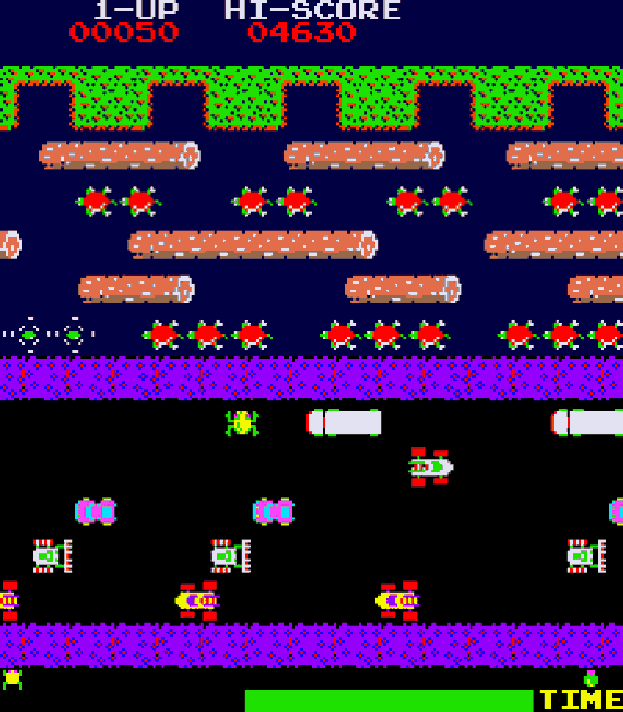

# Documento de concepto
 El juego se presenta como casual, en formato portrait como un desafio de puzzles rapidos. Al estilo Frogger pero tomando la modernidad de juegos como PianoTiles, el jugador debera llegar desde el inferior de la pantalla al punto superior, siguiendo ciertas reglas y pudiendo encontrar obstaculos. 

 ## Reglas del juego
 - Hay un personaje controlable por el jugador en el inferior de la pantalla.
 - El personaje podra atravesar la pantalla, donde hay tres carriles moviendose horizontalmente y avanzando un paso arriba cada vez.
 - Estos carriles presentaran una suerte de grilla, y en cada posicion puede haber un powerup, un obstaculo, una estrella o nada.
     - Es obligatorio que horizontalmente los carriles tengan al menos una estrella
 - El personaje va ganando fever a medida que avanza por las estrellas. 
     - Si no consigue estrellita o power up pierde fever. 
     - Si agarra un obstáculo el personaje pierde una vida y la fever. Si el personaje no tiene fever, pierde una vida.
 - Los power up incluyen una pistola para destruir obstaculos y un escudo de inmunidad.

 ## Inspiraciones 
 ### Frogger 
 
 
 ### Piano Tiles 
 